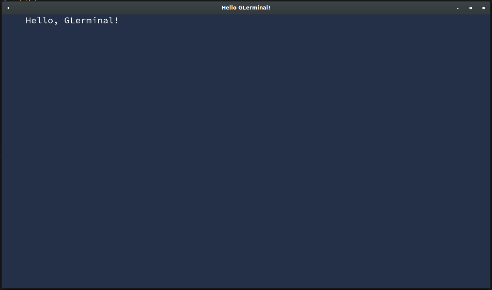

# GLerminal, an OpenGL terminal
[](https://travis-ci.org/Teascade/glerminal)
[](https://docs.rs/glerminal)
[](https://crates.io/crates/glerminal)


Read our [Code of Conduct](CODE_OF_CONDUCT.md) and join our [Discord server](https://discord.gg/Wg6D2Rk) if you want to chat!

A lightweight terminal made with OpenGL from the ground-up.  
With this terminal, you're able to make the terminal applications or games you've always wanted, but with a terminal that looks the same for everyone, because it's made with OpenGL and doesn't use the computer's native terminal!

Currently supported features include:
- Moving the cursor within the Terminal
- Changing foreground and background colors to whatever you want!
- Shaking text
- A text-parser that will make it easy to write whatever you want and make it look cool!
  - Parseable text example: `"Hello, [fg=red]this is red[/fg] and [shake=1.0]this is shaking[/shake]."`
- Drawing of multiple text buffers (grids of text) on top of eachother
- A menu system that allows for easy creation and usage of menus for selecting and pressing stuff! (See docs for more)
  - Requires the `menu_systems` optional feature to be enabled
- Write any characters up to 16-bits that your font supports
  
***Note: Requires OpenGL 3.3+ support***

### Table of Contents
- [How to use](#how-to-use)
- [Custom font?](#custom-font)
- [Contributing & Code of Conduct](#contributing-&-code-of-conduct)
- [License](#license)

### How to use
Extensive documentation can be found at: [docs.rs][docs].

Just add the following line to your `Cargo.toml`:
```toml
[dependencies]
glerminal = "0.2"
```

And then using this crate is quite simple:
```rust
extern crate glerminal; // Not required if running 2018 edition

use glerminal::terminal::TerminalBuilder;
use glerminal::text_buffer::TextBuffer;

fn main() {
    let terminal = TerminalBuilder::new()
        .with_title("Hello GLerminal!")
        .with_dimensions((1280, 720))
        .build();
    let mut text_buffer;
    match TextBuffer::create(&terminal, (80, 24)) {
        Ok(buffer) => text_buffer = buffer,
        Err(error) => panic!(format!("Failed to initialize text buffer: {}", error)),
    }

    text_buffer.write("Hello, GLerminal!");
    terminal.flush(&mut text_buffer);

    while terminal.refresh() {
        terminal.draw(&text_buffer);
    }
}
```



### Custom font?
The default font that comes with GLerminal only includes a few more popular unicode blocks, to save space on the end product (the default font is compiled into the library).  
The following blocks are included in the default font:
- [`Basic latin`][basic_latin]
- [`Latin-1 supplement`][latin_1_supplement]
- [`Latin Extended-A`][latin_extended_a]
- [`Currency Symbols`][currency_symbols]
- [`Box Drawing`][box_drawing]
- [`Block Elements`][block_elements]

Using a custom font currently can be a little difficult, as the only format [`sfl_parser`][sfl_parser] currently supports, is `.sfl`, 
so you will need to create font files of that sort.  
Sadly currently the only sofware I know of that can produce .sfl files is [fontbuilder][fontbuilder], and it currently cannot produce .sfl files on the Windows release available on the GitHub page. the version in Arch Linux AUR repository can however, and that is the one I've been using.

Support for more popular bitmap font standards are on the way for [`sfl_parser`][sfl_parser], but it might take some time. Pull requests, and suggestions for a more popular format are welcome!

### Contributing & Code of Conduct
You are welcome to contribute to this project, but before do review the [Contributing guidelines](CONTRIBUTING.md).

A Code of Conduct can also be found in the repository as [CODE_OF_CONDUCT.md](CODE_OF_CONDUCT.md), 
please review it before interacting with the community.

### License
This crate is distributed under the terms of [the MIT License][license].  
This crate also uses a font as a default font, called [Iosevka][iosevka], which is distributed under the terms of [SIL OFL Version 1.1][license-iosevka].

[docs]: https://docs.rs/glerminal
[license]: LICENSE.md
[iosevka]: https://github.com/be5invis/Iosevka
[license-iosevka]: LICENSE-IOSEVKA.md
[fontbuilder]: https://github.com/andryblack/fontbuilder
[sfl_parser]: https://github.com/teascade/sfl_parser

[basic_latin]: https://en.wikipedia.org/wiki/Basic_Latin_(Unicode_block)
[latin_1_supplement]: https://en.wikipedia.org/wiki/Latin-1_Supplement_(Unicode_block)
[latin_extended_a]: https://en.wikipedia.org/wiki/Latin_Extended-A
[currency_symbols]: https://en.wikipedia.org/wiki/Currency_Symbols_(Unicode_block)
[box_drawing]: https://en.wikipedia.org/wiki/Box_Drawing
[block_elements]: https://en.wikipedia.org/wiki/Block_Elements